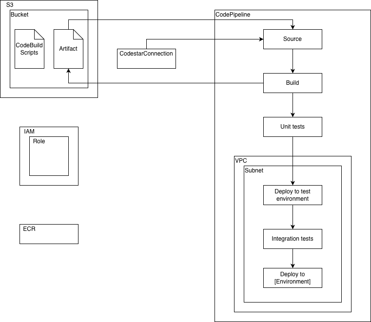

# OPH DevOps Terraform Modules
This module provisions the required CI/CD pipelines for a given repository on AWS CodePipeline.

## Installation
After you setup the configuration, see usage below, run `terraform init` to install module as a dependency.

## Usage
See [example/main.tf](./example/main.tf) for an example configuration.

## How it works

- This module provisions pipelines for a given repository as well as the supporting resources for the pipelines, for a given configuration.

- Supporting resources are:
  - For a given repository, a Codestart Connection is created
  - IAM Roles - for the pipeline as well as AWS CodeBuild job scripts
  - S3 Bucket - for objects managed within the devops configuration
  - CI/CD scripts - S3 Bucket Object. Scripts used in CodeBuild
  - AWS ECR - copy `tonistiigibinfmt` Docker image to AWS ECR
    - In addition to the image above, additional images may be supplied to the configuration to copy to ECR so you may avoid the Docker pull limit

- This project supports 4 types of pipelines:
  1. Build - use for build and running unit tests. Publishes an artifact to AWS S3 for use by a release pipeline
  2. Integration - use for completing integration tests
  3. Release - use for releasing build artifacts from the Build pipeline to target environments
  4. Complete - a combination of all pipeline types, convenient when breaking the CI/CD process is not required

## Contributing
Pull requests are welcome. For major changes, please open an issue first
to discuss what you would like to change.

Please make sure to update tests as appropriate.

## License
[MIT](https://choosealicense.com/licenses/mit/)
